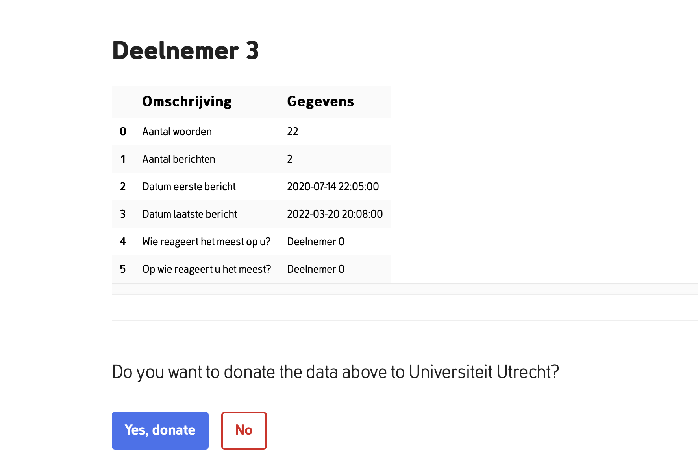

# WhatsApp Data Extractor 

<!-- Include Github badges here (optional) -->
<!-- e.g. Github Actions workflow status -->

In collaboration with the [Human Data Science group](https://hds.sites.uu.nl) and [Eyra](https://eyra.co), the Data Extractor script (as a part of Data [Donation project](https://github.com/eyra/port-poc)) is developed by Soda team to make the information extracted from the WhatsApp Data Download packages(DDPs) accessible to the researchers for further analysis while preserving the the privacy of the datadonators. 

# WhatsApp data donation process

Participants can voluntary donate their whatsapp data for research purposes. 
- Participant can requests for his/her WhatsApp DDPs through the whatsapp application (on group/account level)
- Downloaded data package stores on participant's local storage
- Data extraction and anonymization processes run locally on participant's browser using pyodide technology
- Extracted data can be donatated after being reviewed and approved by the participant 

# Data Extraction overview
This project consists of two main scripts for extracting information from WhatsApp group chats and WhatsApp account data.
The extraction logic is placed in the process function within data_extractor/[whatsapp_chat or whatsapp_account_info]/__init__.py which follows the template format of PORT. More information about collaboration with PORT can be found in this [tutorial]().

The script runs through an online platform called port-poc:
- [Group level](https://next.dev.eyra.co/data-donation/flow/5?session[participant]=test)




- [Account level](https://next.dev.eyra.co/data-donation/flow/6?session[participant]=test)


## Usage

<!-- We should add here -->
- Install Poetry:
```
pip install poetry
```
- install the required python packages :
```
poetry install
```

The behavior of the process function can be verified by running the tests. The test are located in the tests folder.
To run the tests
```
poetry run pytest
```

### Built with

- [python3](https://www.python.org/download/releases/3.0/)
-  [pyodide](https://pyodide.org/en/stable/)


### License

The code in this project is released under [MIT license](LICENSE.md).

<!-- CONTACT -->

## Contact

**WhatsApp Data Extractor** is project by [Human Data Science group](https://hds.sites.uu.nl).
The technical implementation is provided by the [ODISSEI Social Data
Science (SoDa)](https://odissei-data.nl/nl/soda/) team.

Do you have questions, suggestions, or remarks on the technical implementation? File an issue in the
issue tracker or feel free to contact [Parisa Zahedi](https://github.com/parisa-zahedi) or [Shiva Nadi](https://github.com/shNadi)

 

Project Link: [https://github.com/sodascience/port-whatsapp-datadonation](https://github.com/sodascience/port-whatsapp-datadonation)


