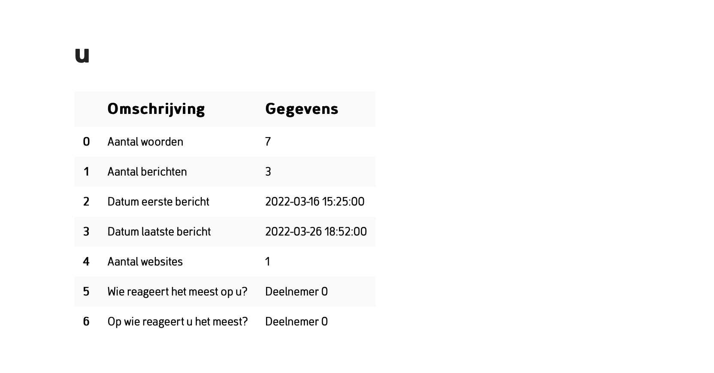
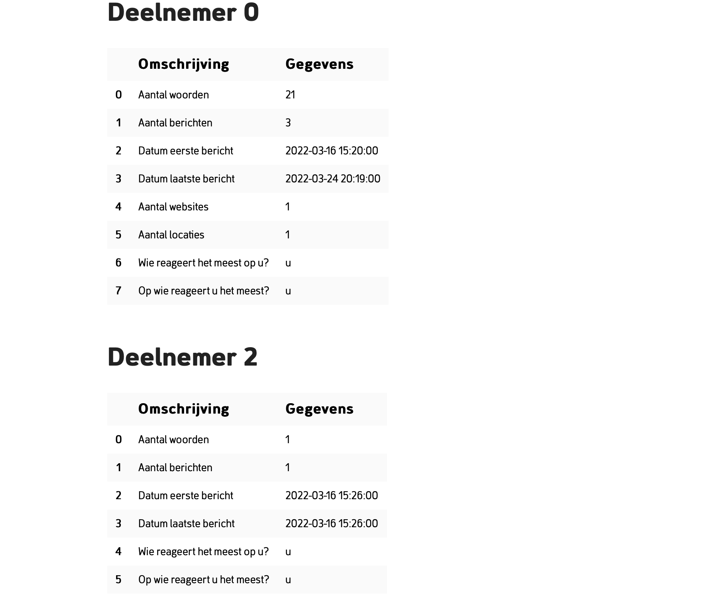
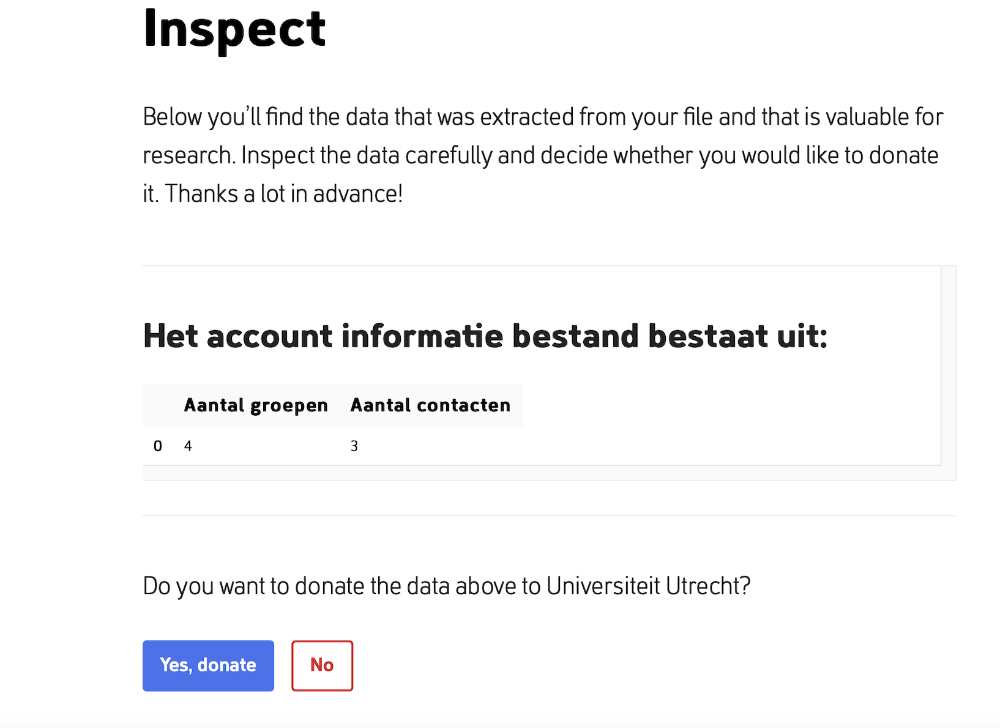

# WhatsApp Data Extractor 

<!-- Include Github badges here (optional) -->
<!-- e.g. Github Actions workflow status -->

WhatsApp datadonation script is developted by SoDa team in collaboration with the [Human Data Science group](https://hds.sites.uu.nl) and [Eyra](https://eyra.co). This project is part of the Data Donation initiative, implemented using [Port](https://github.com/eyra/port), a frontend for data donation. WhatsApp data extractor aims to provide researchers with access to information extracted from WhatsApp Data Download packages (DDPs) for further analysis, all while ensuring the privacy of the data donors.
This study uses a [deprecated version of Port](https://github.com/eyra/port-poc), but major parts of the extraction script can be reused. Here you can find a [list](https://github.com/eyra/port/wiki/Previous-data-donation-studies) of other data donation studies that were completed using Port.

## WhatsApp data donation process

Participants can voluntary donate their whatsapp data for research purposes. 
1. Make a request for your WhatsApp DDPs through the whatsapp application (on group/account level)
2. Download the data package on your local storage.
3. Login to Port environement and select your data package. Please keep in your mind that data extraction and anonymization processes run locally on your browser. It means you have not shared any data yet.
4. Review the extracted data and donate it in case of agreement.

## Data Extraction overview

This project consists of two main scripts for extracting information from WhatsApp group chats and WhatsApp account data.
The extraction logic is placed in the process function within data_extractor/[whatsapp_chat or whatsapp_account_info]/__init__.py which follows the template format of PORT. More information about collaboration with PORT can be found [here](https://github.com/eyra/port).

The script runs through an online platform called port:
- Group level




- Account level


## Usage

<!-- We should add here -->
- Install Poetry:
```
pip install poetry
```
- install the required python packages :
```
poetry install
```

The behavior of the process function can be verified by running the tests. The test are located in the tests folder.
To run the tests
```
poetry run pytest
```

### Built with

- [python3](https://www.python.org/download/releases/3.0/)
-  [pyodide](https://pyodide.org/en/stable/)


### License

The code in this project is released under [MIT license](LICENSE.md).

<!-- CONTACT -->

## Contact

**WhatsApp Data Extractor** is project by [Human Data Science group](https://hds.sites.uu.nl).
The technical implementation is provided by the [ODISSEI Social Data
Science (SoDa)](https://odissei-data.nl/nl/soda/) team.

Do you have questions, suggestions, or remarks on the technical implementation? File an issue in the
issue tracker or feel free to contact [Parisa Zahedi](https://github.com/parisa-zahedi) or [Shiva Nadi](https://github.com/shNadi)

 

Project Link: [https://github.com/sodascience/port-whatsapp-datadonation](https://github.com/sodascience/port-whatsapp-datadonation)

